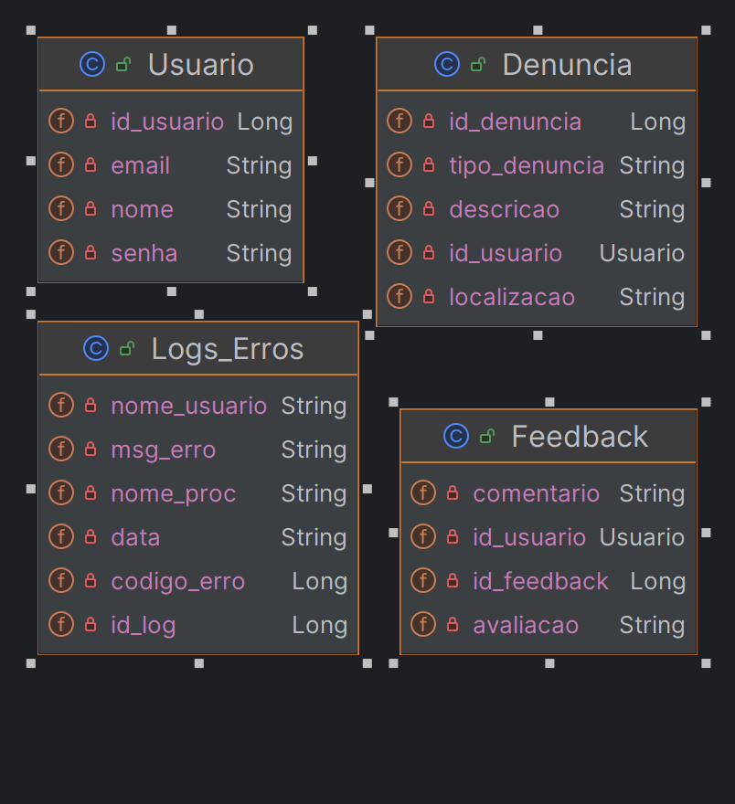
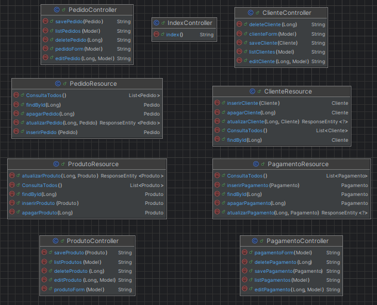

<div align="center">
    <h2>Wink</h2>
</div>

--------------------------------------------------
## 📚 Projeto 
<h4>Introdução</h4> 

- Imagine uma solução que torna a navegação em aplicativos mais fácil e acessível para todos, especialmente para aqueles que podem sentir-se perdidos ou confusos ao usar novas tecnologias. Nosso projeto visa criar um ChatBot inteligente que atua como um guia amigável, ajudando os usuários a navegar pela aplicação e responder suas dúvidas sobre produtos. Nosso foco principal é oferecer suporte para o público idoso, que muitas vezes enfrenta dificuldades com a tecnologia e pode se beneficiar enormemente de uma assistência personalizada e intuitiva.
<p></p>

<h4>Objetivos</h4> 

- Facilitar a Navegação
- Fornecer Assistência Personalizada
- Reduzir a Frustração e a Ansiedade
- Responder Dúvidas sobre Produtos
- Promover a Inclusão Digital
- Coletar Feedbacks e Melhorias Contínuas
- Aumentar a Satisfação do Cliente

<p></p>

--------------------------------------------------

<h3>Integrantes</h3>

- Thiago Ulrych - RM97951
- Bruno Ramos da Costa - RM551942
- Guilherme Faria de Aguiar - RM551374
- Henrique Roncon Pereira - RM99161
- Lucas Carabolad Bob - RM550519
--------------------------------------------------

<h3>Como Rodar a Aplicação </h3>

<h4>Pré-requisitos</h4> 

- [Java Development Kit (JDK)](https://www.mysql.com/downloads/) instalado em seu sistema.
- [Eclipse IDE](https://www.eclipse.org/downloads/) instalado em seu sistema.

<h4>Passos para Executar a Aplicação</h4> 

- Clonar o Repositório:
```bash
git clone https://github.com/1tico1/WinkS.git
```

<h4>Tabela de EndPoints(Localhost:8080/)</h4> 

Localhost:8080/

Localhost:8080/cliente
  - FindAll (/list)
  - Put (/new)
  - Post (/save)
  - Delete (/delete/{id})
  - edit (/edit/{id})

  Localhost:8080//pagamento
  - FindAll (/list)
  - Put (/new)
  - Post (/save)
  - Delete (/delete/{id})
  - edit (/edit/{id})

  Localhost:8080/pedido
  - FindAll (/list)
  - Put (/new)
  - Post (/save)
  - Delete (/delete/{id})
  - edit (/edit/{id})

  Localhost:8080/produto
   - FindAll (/list)
  - Put (/new)
  - Post (/save)
  - Delete (/delete/{id})
  - edit (/edit/{id})


--------------------------------------------------

## 📈 Diagrama

<div>
    
</div>
<div>
    
</div>


<br/>
# Wink
Spring Boot aplication for PluSoft
